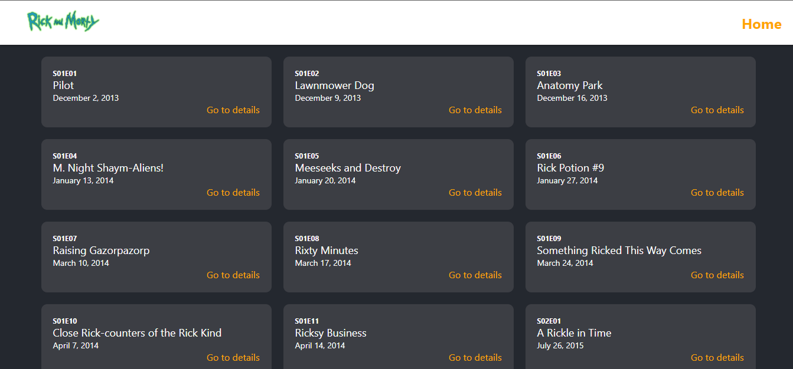

# Getting Started with Create React App

This project was bootstrapped with [Create React App](https://github.com/facebook/create-react-app).
Below you will find some information on how to perform common tasks.

## Description

This project is about Rick And Morty series. It contains series episodes, information for each episode and information for each character in episode.

## Screenshots

`Home`


`Episode Detail`


`Character Detail`


## Technologies Used

Jest and Enzyme modules are used to write test codes. React Router v6 is used to access corresponding component with URL. Axios is used to send request to APIs and take response from APIs. SASS is used to add stylesheet to JS files.

### Jest and Enzyme

[Jest](https://jestjs.io/) is a delightful JavaScript Testing Framework with a focus on simplicity.
[Enzyme](https://enzymejs.github.io/enzyme/) is a JavaScript Testing utility for React that makes it easier to test your React Components' output.
Each component in this project are tested with Jest and Enzyme.

`Home.test.js`

```
import React from 'react';
import Enzyme, { shallow } from 'enzyme';
import Adapter from '@wojtekmaj/enzyme-adapter-react-17';
import { Home } from '../../components';

Enzyme.configure({ adapter: new Adapter() });

describe('Home', () => {
    it('rendering home', () => {
        const component = shallow(<Home />);
        expect(component).not.toBe(null);
        expect(component.getElements()).toMatchSnapshot();
    });
});
```

### React Router

[React Router](https://reactrouter.com/) is a lightweight, fully-featured routing library for the React JavaScript library.
Pages are mapped with their URL's. Thus, it can be swictable between pages.

`App.js`

```
<BrowserRouter>
    <Header />
    <Routes>
        <Route path='/' element={<Home />} />
        <Route path='/episodes/:episode' element={<EpisodeDetail />} />
        <Route path='/characters/:character' element={<CharacterDetail />} />
    </Routes>
</BrowserRouter>
```

### Axios

[Axios](https://axios-http.com/) is a simple promise based HTTP client for the browser and node.js.
By using axios, required data are taken with HTTP requests.

`getById.js`

```
import axios from 'axios';
import { baseUrl } from '../constant';

const getById = async _id => {
    try {
        const config = {
            baseURL: baseUrl,
            url: `/episode/${_id}`,
            method: 'GET'
        };

        const response = await axios(config);
        
        const result = response.data;
        return result;
    } catch (e) {
        return e;
    }
}

export default getById;
```

### SASS

[Sass](https://sass-lang.com/) is the most mature, stable, and powerful professional grade CSS extension language in the world.
Sass provided styles for tags in components.

`index.module.scss`

```
.container {
    display: flex;
    flex-direction: row;
    flex-wrap: wrap;
    justify-content: center;
    padding: {
        top: 20px;
        bottom: 20px;
    };
    gap: 20px;
}
```

## Available Scripts

In the project directory, you can run:

### `npm start`

Runs the app in the development mode.\
Open [http://localhost:3000](http://localhost:3000) to view it in your browser.

The page will reload when you make changes.\
You may also see any lint errors in the console.

### `npm test`

Launches the test runner in the interactive watch mode.\
See the section about [running tests](https://facebook.github.io/create-react-app/docs/running-tests) for more information.

### `npm run build`

Builds the app for production to the `build` folder.\
It correctly bundles React in production mode and optimizes the build for the best performance.

The build is minified and the filenames include the hashes.\
Your app is ready to be deployed!

See the section about [deployment](https://facebook.github.io/create-react-app/docs/deployment) for more information.

### `npm run eject`

**Note: this is a one-way operation. Once you `eject`, you can't go back!**

If you aren't satisfied with the build tool and configuration choices, you can `eject` at any time. This command will remove the single build dependency from your project.

Instead, it will copy all the configuration files and the transitive dependencies (webpack, Babel, ESLint, etc) right into your project so you have full control over them. All of the commands except `eject` will still work, but they will point to the copied scripts so you can tweak them. At this point you're on your own.

You don't have to ever use `eject`. The curated feature set is suitable for small and middle deployments, and you shouldn't feel obligated to use this feature. However we understand that this tool wouldn't be useful if you couldn't customize it when you are ready for it.